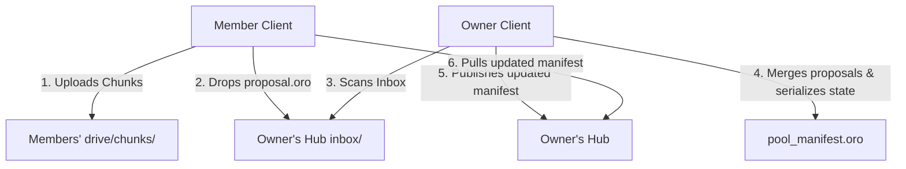

# FlashMesh — Base Version Blueprint & Tauri Integration Plan

This blueprint documents the core architecture, files, and features of the Electron/PWA base version of FlashMesh (located in [basic build](file:///home/dhanush/FlashMesh/basic%20build/FlashMesh)). It provides structured instructions and file links to help integrate these features into the current **Rust-backed Tauri + React/TS** application.

---

## 1. Directory Structure & File Map

Below are clickable links to the key files of the base version. You can use these files directly as reference templates.

### Core Architecture & Logic
* **Product Blueprint:** [README.txt](file:///home/dhanush/FlashMesh/basic%20build/FlashMesh/README.txt) — Comprehensive overview of the distributed mesh storage platform, authentication, and protocols.
* **Data Pools System:** [datapool.js](file:///home/dhanush/FlashMesh/basic%20build/FlashMesh/src/core/datapool.js) — Implements collaborative shared storage (the Outpost Model), proposal workflows, and rebalancing.
* **Merkle Search Tree:** [mst.js](file:///home/dhanush/FlashMesh/basic%20build/FlashMesh/src/core/mst.js) — Deterministic, content-addressed, delta-syncable search tree and database-like index manager.
* **Platform Adapter:** [platform-adapter.js](file:///home/dhanush/FlashMesh/basic%20build/FlashMesh/src/core/platform-adapter.js) — Abstracts API calls between native desktop (Electron) and browser-only (PWA) environments.
* **Application Shell (Electron Main):** [main.js](file:///home/dhanush/FlashMesh/basic%20build/FlashMesh/src/core/main.js) — Manages window lifecycle, secure local HTTP redirection server (OAuth callback), streaming video range headers, and local filesystem APIs.
* **Main Script / UI Renderer:** [renderer.js](file:///home/dhanush/FlashMesh/basic%20build/FlashMesh/src/core/renderer.js) — The bulk of UI logic, context menus, media viewers, clipboard operations, upload/download threads, and the Ouroboros encryption pipeline.
* **Electron Preload Bridge:** [preload.js](file:///home/dhanush/FlashMesh/basic%20build/FlashMesh/src/core/preload.js) — Secure IPC bridge to expose main process functions.

### Modules & Providers
* **Crypto Engine:** [crypto.js](file:///home/dhanush/FlashMesh/basic%20build/FlashMesh/src/modules/crypto.js) — Wraps Web Crypto API (SubtleCrypto) for zero-knowledge client-side encryption.
* **Google Drive Provider:** [google.js](file:///home/dhanush/FlashMesh/basic%20build/FlashMesh/src/providers/google.js) — Custom REST calls to interact with Google Drive API v3.
* **Base Provider Interface:** [base.js](file:///home/dhanush/FlashMesh/basic%20build/FlashMesh/src/providers/base.js) — Standardized layout for cloud storage service endpoints.

### Hardening Scripts
* **Electron Packaging Hardener:** [harden-electron.js](file:///home/dhanush/FlashMesh/basic%20build/FlashMesh/harden-electron.js) — Automated pipeline script to apply control flow flattening, string encoding, and API key injection for production.
* **Web Build Bundler:** [build-web.js](file:///home/dhanush/FlashMesh/basic%20build/FlashMesh/build-web.js) — Concatenates, bundles, and obfuscates frontend scripts for progressive web app (PWA) releases.

---

## 2. Feature Walkthrough & Integration Guide

### A. Data Pools (The "Outpost Model")

The base version introduces collaborative, decentralized shared vaults called **Data Pools**.



#### How it works in the Base Version
1. **Hub Folder:** The pool creator (Owner) hosts a public folder containing `pool_manifest.oro` and an `inbox/` subfolder.
2. **Proposal-Based Concurrency:** Instead of direct edits to the manifest (which causes race conditions), members write encrypted JSON proposal files (`prop_UUID.oro`) describing actions (joining, uploading, creating folders, moves) to the owner's `inbox/`.
3. **Inbox Processing:** The owner's app periodically polls the inbox, processes proposals in order, writes updates to the master pool manifest, and deletes the proposals.
4. **Replicas & HA:** Uploaded chunks are scattered round-robin across member folders. Members declare their chunks directories public to allow other pool members to read chunk files.

#### Tauri Porting Strategy
* **Backend vs. Frontend:** The coordination logic can remain in the TypeScript layer (`src/mesh/`) or be offloaded to Rust. Moving the manifest read/write operations to Rust (`src-tauri/src/commands/operations.rs`) will make parsing, validation, and cryptography faster.
* **Rust Data Pool Model:** Create a data struct in Rust:
  ```rust
  #[derive(Serialize, Deserialize)]
  pub struct DataPool {
      pub id: String,
      pub name: String,
      pub owner_fp: String,
      pub hub_folder_id: String,
      pub inbox_folder_id: String,
      pub members: Vec<PoolMember>,
      pub files: Vec<PoolFile>,
      pub folders: Vec<PoolFolder>,
  }
  ```
  Expose a Tauri command `process_pool_inbox` in [lib.rs](file:///home/dhanush/FlashMesh/src-tauri/src/lib.rs) that fetches proposals using the Rust Google Drive adapter, decrypts them, updates the manifest, and updates the local state.

---

### B. Merkle Search Trees (MST) & Indexing

The MST is a deterministic, content-addressed, order-independent search tree used to synchronize pool directories.

#### How it works in the Base Version
1. **Self-Balancing Structure:** Node structure is derived strictly from SHA-256 hashes of keys. Peers holding identical entries always generate the exact same tree structure and root hash.
2. **Delta Synchronization:** Two clients can compare their pool root hashes. If they differ, they traverse only the branches that differ to sync changes with minimal API calls.
3. **Index Manager:** `MSTIndexManager` (in `mst.js`) indexes MST records by folder, extension, member, and search query tokens for $O(1)$ lookups in the UI, avoiding tree walks on every render.

#### Tauri Porting Strategy
* **TypeScript Implementation:** You already have a strong TypeScript-based MST at [mst.ts](file:///home/dhanush/FlashMesh/src/mesh/mst.ts).
* **Action Item:** Add `MSTIndexManager` class directly to `mst.ts` to allow local file grid components (`FileGrid.tsx`) to filter by folder or search tokens instantaneously.
* **Rust Integration:** If performance suffers on deep directories, port the MST builder to Rust in `src-tauri/src/commands/search.rs`. Rust's native SHA-256 (via the `sha2` crate) is faster than the Web Crypto API.

---

### C. Omnitrix Circular / Radial Context Menu

A glassmorphic circular overlay menu that acts radially based on the mouse angle, allowing keyboard and mouse gesture navigation.

#### How it works in the Base Version
1. **Dynamic Coordinates:** Placed at `e.pageX` and `e.pageY` on context menu events.
2. **Radial Math:** Distributes items in a circle using:
   $$\theta = \frac{index}{count} \times 2\pi - \frac{\pi}{2}$$
   $$X = \cos(\theta) \times Radius, \quad Y = \sin(\theta) \times Radius$$
3. **Interactive Angles:** Listens for mouse moves, calculates:
   $$\theta_{current} = \operatorname{atan2}(dy, dx)$$
   It highlights the closest menu item by comparing the cursor angle to each item's static angle.
4. **Keyboard Binding:** Listens to Arrow Keys to map directional selections (e.g. `ArrowUp` points to $-\frac{\pi}{2}$, `ArrowLeft` points to $\pi$).

#### React/Tauri Porting Strategy
1. **CSS Integration:** Copy the CSS rules for `#circular-context-menu`, `.omnitrix-center`, `.omnitrix-ring`, `.omnitrix-bg`, and `.omnitrix-item` from `renderer.js` into [App.css](file:///home/dhanush/FlashMesh/src/App.css).
2. **React Component:** Create a functional React component at `src/components/ContextMenu/RadialContextMenu.tsx`:
   ```tsx
   import React, { useState, useEffect } from 'react';
   // Implement mousemove angle math and click selectors inside React state.
   ```
3. **Hook up to File Cards:** Bind `onContextMenu` on [FileCard.tsx](file:///home/dhanush/FlashMesh/src/components/FileGrid/FileCard.tsx) to trigger this custom overlay instead of default system menus.

---

### D. Keyboard Shortcuts

Power-user shortcuts to perform file system operations instantly.

#### Shortcut Mappings from the Base Version
* `Ctrl + N`: Create new file (text)
* `Ctrl + Shift + N`: Create new folder
* `Ctrl + U`: Trigger upload modal/dialog
* `Ctrl + D`: Decrypt & download selected files
* `Ctrl + A`: Select all files in current grid
* `Ctrl + C` / `Ctrl + X` / `Ctrl + V`: Cross-provider Copy/Cut/Paste
* `Ctrl + R`: Refresh current directory
* `Delete`: Move selected items to trash
* `Enter`: Open/Preview file or navigate into folder
* `Alt + ArrowUp`: Navigate up one level (parent directory)
* `Escape`: Close any active floating media viewer/modal
* `F2`: Start inline renaming on the selected item

#### Tauri Porting Strategy
* Implement a unified global shortcut hook at `src/hooks/useKeyboardShortcuts.ts` that attaches to `document.addEventListener('keydown')`.
* Prevent execution if the user is typing inside an `<input>` or `<textarea>` by checking `document.activeElement.tagName`.

---

### E. Cross-Cloud Clipboard Operations

A virtual clipboard that allows copying/cutting files and folders between local folders, Google Drive, and Dropbox.

#### How it works in the Base Version
It handles six distinct clipboard paste paths:
1. **Cloud to Cloud (Same Provider):** API-driven copy/move (no download required).
2. **Cloud to Cloud (Different Provider):** Streams chunks down, decrypts/re-encrypts with a new destination session key, and uploads chunks to the destination provider.
3. **Cloud to Local:** Streams down and decrypts directly to the user's hard drive.
4. **Local to Cloud:** Encrypts local file chunks on-the-fly and uploads them.
5. **Local to Local:** Native OS move/copy commands.
6. **Data Pool Transfers:** Syncs pool-specific manifests.

#### Tauri Integration
* The current Rust commands [operations.rs](file:///home/dhanush/FlashMesh/src-tauri/src/commands/operations.rs) handle local file transfers (`copy_items`, `move_items`, `delete_items`).
* **Implementation Plan:** Modify your React clipboard store (or state) to hold selected file objects (including source providers). When pasting:
  * If both source and destination are local, invoke the Tauri `copy_items` / `move_items` command.
  * If cross-cloud, utilize `MeshEngine.ts` to stream chunks in-memory or pipe them using Tauri temporary files.

---

## 3. Hardening & Obfuscation Pipeline

To secure API credentials, cryptographic configurations, and key storage from reverse engineering, the base build utilizes an automated pipeline.

* **API Key Injection:** Keys are read from `.env` and injected dynamically into the JavaScript code at compile time.
* **Control Flow Flattening:** Obfuscates source code into state machines to prevent static analysis.
* **ASAR Packaging:** Electron builds are wrapped in ASAR archives.

### Tauri Hardening Strategy
1. **Rust Compilation Security:** Rust binaries are compiled as release builds (`cargo tauri build`) which automatically strips debug symbols and converts the backend into machine code. Use the `strip = true` and `opt-level = 3` profiles in `Cargo.toml`.
2. **Frontend Obfuscation:** Integrate `rollup-plugin-javascript-obfuscator` inside your Vite bundler configuration ([vite.config.ts](file:///home/dhanush/FlashMesh/vite.config.ts)):
   ```typescript
   import obfuscator from 'rollup-plugin-javascript-obfuscator';
   export default defineConfig({
     plugins: [
       obfuscator({
         compact: true,
         controlFlowFlattening: true,
         stringArrayEncoding: ['rc4'],
       })
     ]
   });
   ```
